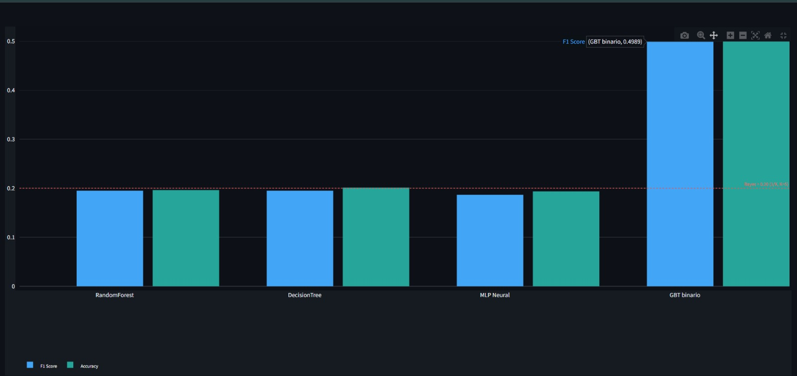
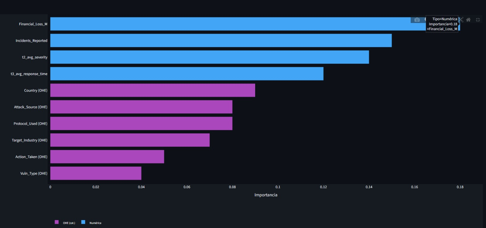
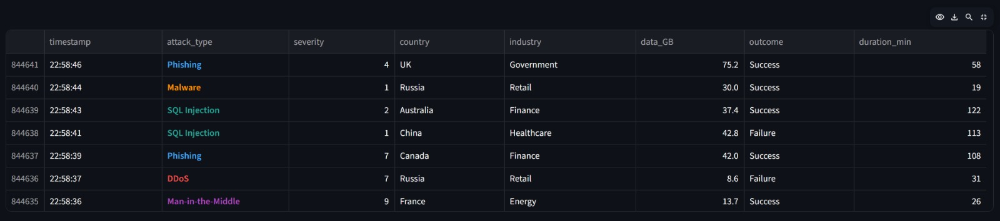
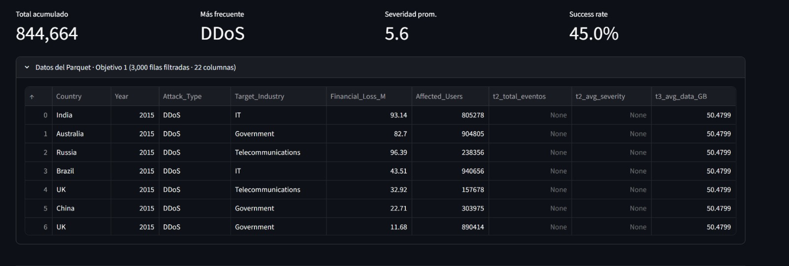

# Dashboard 04 - ML y Feed en Vivo

## Proposito del dashboard

Este dashboard representa la parte mas avanzada del producto. Tiene dos componentes:

```text
1. Objetivo 2: Machine Learning con T3
2. Feed live demo: eventos en vivo simulados
```

La parte principal para defender como Objetivo 2 es ML. El feed live complementa la ruta hacia monitoreo en tiempo real.

## A quien le beneficia

| Usuario | Beneficio |
| --- | --- |
| Analistas SOC | Ven una aproximacion a monitoreo live y clasificacion de ataques |
| Equipo de ciencia de datos | Evalua modelos y variables predictivas |
| DevSecOps | Entiende como se podria integrar con logs reales |
| Investigadores | Compara algoritmos y limitaciones del dataset |
| Docente/evaluador | Verifica que existe un componente ML y una ruta a produccion |

## Como se usaria

En exposicion, se debe presentar asi:

> Este dashboard corresponde al Objetivo 2. Usamos T3 para entrenar modelos de clasificacion con Spark MLlib. Ademas, incluimos un feed live demo para mostrar como la arquitectura podria evolucionar a monitoreo en tiempo real.

En un caso real, se podria usar para:

- Comparar modelos de clasificacion.
- Ver si las variables tecnicas ayudan a distinguir ataques.
- Monitorear eventos recientes.
- Preparar integracion futura con SIEM, Kafka o logs reales.

---

# Parte A - Objetivo 2: Machine Learning

## Que se quiere resolver

El Objetivo 2 busca construir un modelo predictivo de clasificacion de ataques a escala.

Problema ML principal:

```text
Predecir attack_type usando variables tecnicas de T3
```

Tipo de problema:

```text
Clasificacion multiclase
```

Clases esperadas:

```text
DDoS
Malware
Phishing
Ransomware
SQL Injection
```

## Como se llego a mostrar esto desde la data

### Entrada ML

```text
T3_synthesized.csv
```

T3 se usa porque contiene variables tecnicas adecuadas para clasificacion:

```text
data_compromised_GB
attack_duration_min
attack_severity
response_time_min
target_system
outcome
security_tools_used
user_role
industry
mitigation_method
```

### Scripts usados

```text
pipeline_linux.py -> ML v1 base
ml_v2.py -> ML v2 mejorado
```

### Flujo ML v1

```text
T3 sampled
 -> StringIndexer
 -> VectorAssembler
 -> StandardScaler
 -> RandomForestClassifier
 -> CrossValidator
 -> F1 / Accuracy
```

Variables base v1:

```text
data_compromised_GB
attack_duration_min
attack_severity
response_time_min
```

### Flujo ML v2

```text
T3 completo filtrado
 -> variables numericas
 -> variables categoricas con OneHotEncoding
 -> modelos RF / DT / MLP
 -> metricas F1 y Accuracy
```

Variables numericas:

```text
data_compromised_GB
attack_duration_min
attack_severity
response_time_min
```

Variables categoricas con OHE:

```text
target_system
outcome
security_tools_used
user_role
industry
mitigation_method
```

### Tarea adicional en ML v2

Tambien se entrena una tarea binaria:

```text
Predecir outcome Success/Failure con GBTClassifier
```

Metricas:

```text
AUC-ROC
Accuracy
F1
```

## Modelos usados

Modelo principal:

```text
RandomForestClassifier - Spark MLlib
```

Modelos comparados:

```text
RandomForest
DecisionTree
Multilayer Perceptron
GBTClassifier
```


## Para que sirve cada algoritmo en el widget ML

| Algoritmo | Para que sirve | Como defenderlo en exposicion |
| --- | --- | --- |
| `RandomForest` | Clasificacion multiclase de `attack_type` usando varios arboles de decision | Es el modelo principal porque es estable, reduce sobreajuste frente a un solo arbol y permite comparar importancia de variables |
| `DecisionTree` | Clasificacion con reglas simples tipo arbol | Sirve como modelo interpretable y baseline: permite ver si reglas simples ya separan las clases |
| `MLP Neural` | Clasificacion con una red neuronal multicapa | Se usa para probar si una arquitectura no lineal aprende patrones que los arboles no capturan |
| `GBT binario` | Clasificacion binaria de `outcome` Success/Failure | No resuelve exactamente el mismo problema multiclase; se incluye como tarea adicional para evaluar exito o fallo del evento |

Resumen para decirlo rapido:

> RandomForest es nuestro modelo principal para clasificar tipos de ataque. DecisionTree funciona como comparacion interpretable. MLP prueba una red neuronal. GBT se usa en una tarea binaria distinta: predecir si el resultado fue Success o Failure.

## Grafico: Metricas F1 / Accuracy por algoritmo

Este grafico compara el desempeno de los modelos.

Metricas:

```text
F1 Score
Accuracy
AUC-ROC para GBT binario
```

Como interpretarlo:

> Si F1 y Accuracy estan cerca de 0.20 en clasificacion de 5 clases, el modelo esta cerca de una referencia aleatoria. Eso no invalida el pipeline; muestra que el dataset sintetico no tiene senal predictiva fuerte.

Linea base:

```text
5 clases -> 1 / 5 = 0.20
```

Como explicarlo:

> La parte importante del Objetivo 2 no es afirmar que el modelo ya es perfecto, sino demostrar el flujo ML completo: preparacion de datos, encoding, entrenamiento, validacion y comparacion de modelos.

## Grafico: Importancia relativa de features

En el Objetivo 2, las variables deben interpretarse desde T3.

Variables correctas para explicar:

```text
data_compromised_GB
attack_duration_min
attack_severity
response_time_min
target_system_ohe
outcome_ohe
security_tools_used_ohe
user_role_ohe
industry_ohe
mitigation_method_ohe
```

Importante:

> Si en alguna visualizacion aparecen nombres de ejemplo que mezclan T1/T2, en la defensa oral se debe aclarar que el Objetivo 2 se sustenta en T3. Las variables tecnicas reales usadas por los scripts ML salen de T3.

## Que es OHE

OHE significa One Hot Encoding.

Sirve para convertir categorias en columnas numericas.

Ejemplo:

```text
industry = Finance, Healthcare, Education
```

Se convierte en:

```text
industry_Finance
industry_Healthcare
industry_Education
```

Esto permite que algoritmos de ML trabajen con variables categoricas.

## Relacion con el Objetivo 2

Este dashboard es la evidencia visual del Objetivo 2:

```text
T3 -> Spark MLlib -> modelos -> metricas -> dashboard
```

Debe explicarse asi:

> El Objetivo 2 no depende del join completo. Usa T3 porque contiene variables tecnicas mas apropiadas para clasificacion. El dashboard muestra los resultados comparativos de los modelos.

---

# Parte B - Feed en vivo

## Proposito

El feed live muestra una ruta hacia monitoreo en tiempo real.

Flujo implementado:

```text
event_generator.py -> live_events.csv -> dashboard.py
```

## Como se llego a mostrar esto desde la data

El feed no viene de T1/T2/T3 historicos. Viene de un generador:

```text
event_generator.py
```

Campos generados:

```text
timestamp
attack_type
severity
country
industry
data_GB
outcome
duration_min
```

El dashboard lee:

```text
live_events.csv
```

Y refresca la vista cada pocos segundos.

## Que muestra

- Eventos recientes.
- Tipo de ataque.
- Severidad.
- Pais.
- Industria.
- Datos comprometidos.
- Resultado.
- Total acumulado.
- Ataque mas frecuente.
- Severidad promedio.
- Success rate.

## Como interpretarlo

> El feed permite simular que el sistema esta recibiendo eventos recientes. En esta version es modo demo, pero la estructura permite reemplazarlo por logs reales.

## Es real o simulado?

Respuesta correcta:

> Es live demo o streaming simulado. No es Kafka real todavia. En produccion se reemplazaria por logs reales de Suricata, Wazuh, Zeek, Syslog, firewall o SIEM.

## Relacion con produccion

Ruta futura:

```text
Logs reales -> Kafka -> Parser -> Dashboard / Alertas
```

Esto permitiria evolucionar el producto hacia un mini-SIEM.

---

# Como defender este dashboard

## Que parte es Objetivo 2?

La parte ML:

```text
T3 -> Spark MLlib -> modelos -> metricas
```

## Que parte es complemento live?

El feed:

```text
event_generator.py -> live_events.csv -> dashboard.py
```

## Como se relaciona con visualizacion?

El dashboard une dos salidas:

```text
Metricas ML -> panel ML
live_events.csv -> feed en vivo
```

No entrena en vivo; visualiza resultados y eventos.

## Preguntas probables

### Que modelo usaron para el Objetivo 2?

Respuesta:

> El modelo principal es RandomForestClassifier de Spark MLlib. Tambien comparamos DecisionTree, MLP y GBT en la version mejorada.

### Que datos usa el Objetivo 2?

Respuesta:

> Usa T3, porque T3 contiene variables tecnicas como datos comprometidos, duracion del ataque, severidad y tiempo de respuesta.

### Por que el modelo no tiene accuracy alta?

Respuesta:

> Porque es una clasificacion multiclase con datos sinteticos y las variables no separan perfectamente las clases. El objetivo es demostrar el pipeline ML completo, no afirmar que ya tenemos un detector productivo.

### Que significa F1 cercano a 0.20?

Respuesta:

> Como son 5 clases, una referencia aleatoria esta cerca de 1/5, es decir 0.20. Si el modelo esta cerca de eso, significa que necesita mejores datos o mejores features.

### Para que sirve entonces el ML?

Respuesta:

> Sirve como prueba de arquitectura ML: carga de datos, transformacion, encoding, entrenamiento, validacion y comparacion de modelos. Con datos reales podria mejorar y convertirse en clasificador operativo.

### El feed vivo es streaming real?

Respuesta:

> Es streaming simulado en modo demo. El generador escribe eventos constantemente y el dashboard los refresca. En produccion se reemplaza por Kafka o logs reales.

### Esto ya es un SIEM?

Respuesta:

> No es un SIEM completo. Es una base para evolucionar a mini-SIEM porque ya tiene dashboard, feed live, ML y arquitectura preparada para logs reales.

### Que se necesita para mejorar ML?

Respuesta:

> Datos reales etiquetados, balanceo de clases, mejores features, validacion temporal, control de falsos positivos y despliegue de modelos versionados.

## Frase para exposicion

> Este dashboard corresponde al Objetivo 2 porque muestra el flujo de machine learning con T3: preparacion de variables, entrenamiento, comparacion de modelos y metricas. El feed en vivo complementa la vision mostrando como el producto puede evolucionar hacia monitoreo real con logs y Kafka.


---

# Capturas del Dashboard 04 y explicacion por imagen

Estas capturas se pueden usar directamente en la exposicion. El orden recomendado es: primero ML, luego importancia de variables, despues feed vivo y finalmente tabla Parquet para conectar con el Objetivo 1.

## Imagen 1 - Metricas F1 / Accuracy por algoritmo



### Que se ve

La grafica compara modelos de machine learning con dos metricas:

```text
F1 Score
Accuracy
```

Modelos mostrados:

```text
RandomForest
DecisionTree
MLP Neural
GBT binario
```

Tambien aparece una linea de referencia cerca de `0.20`.

### Como se llego a mostrar desde la data

El flujo viene de T3:

```text
T3_synthesized.csv
 -> pipeline_linux.py / ml_v2.py
 -> preparacion de variables
 -> entrenamiento de modelos
 -> calculo de F1 y Accuracy
 -> dashboard.py
```

En ML v1, el flujo base fue:

```text
T3 sampled
 -> StringIndexer para attack_type
 -> VectorAssembler con 4 variables numericas
 -> StandardScaler
 -> RandomForestClassifier
 -> CrossValidator
 -> F1 / Accuracy
```

En ML v2, el flujo mejorado fue:

```text
T3 completo filtrado
 -> variables numericas + categoricas
 -> OneHotEncoding para categorias
 -> RF / DecisionTree / MLP
 -> F1 / Accuracy
 -> GBT para outcome Success/Failure
```


### Para que sirve cada algoritmo mostrado

- `RandomForest`: modelo principal para clasificar `attack_type`; combina varios arboles y suele ser mas estable que un solo arbol.
- `DecisionTree`: modelo mas simple e interpretable; sirve para comparar contra reglas de decision basicas.
- `MLP Neural`: red neuronal multicapa; se prueba para capturar relaciones no lineales entre variables.
- `GBT binario`: modelo de arboles boosting para una tarea binaria: predecir `outcome` Success/Failure. No debe compararse directamente como si fuera la misma tarea multiclase.

Ejemplo breve:

> RandomForest, DecisionTree y MLP intentan clasificar el tipo de ataque. GBT responde otra pregunta: si el evento termina en Success o Failure.

### Como explicarlo en exposicion

> Esta grafica corresponde al Objetivo 2. Comparamos modelos de clasificacion usando variables tecnicas de T3. RandomForest, DecisionTree y MLP intentan clasificar el tipo de ataque. GBT se usa como tarea binaria para predecir `outcome`, es decir, Success o Failure.

### Como interpretar el resultado

La linea `0.20` es una referencia para clasificacion multiclase:

```text
5 clases -> 1 / 5 = 0.20
```

Si RandomForest, DecisionTree o MLP estan cerca de `0.20`, significa que con esos datos sinteticos el modelo no separa claramente las clases.

El GBT binario se ve mas alto porque no esta resolviendo exactamente la misma tarea multiclase. Su tarea es binaria:

```text
Success / Failure
```

### Ejemplo para explicar

> Si el modelo tiene que elegir entre cinco ataques, acertar al azar estaria cerca de 20%. Por eso usamos la linea base. En cambio, GBT trabaja con dos clases, Success o Failure, por eso su comparacion debe explicarse como tarea binaria, no como el mismo problema multiclase.

### Pregunta probable

**Por que GBT sale mejor?**

Respuesta:

> Porque GBT esta en una tarea binaria de `outcome`, no en la misma clasificacion multiclase de `attack_type`. Por eso se muestra como referencia adicional, pero el Objetivo 2 principal se defiende con la clasificacion de ataques usando T3.

---

## Imagen 2 - Importancia relativa de features



### Que se ve

La grafica muestra una lista de variables ordenadas por importancia. Las barras azules representan variables numericas y las barras moradas representan variables categoricas codificadas con OHE.

En la captura aparecen variables como:

```text
Financial_Loss_M
Incidents_Reported
t2_avg_severity
t3_avg_response_time
Country OHE
Attack_Source OHE
Protocol_Used OHE
Target_Industry OHE
```

### Como justificarlo correctamente

Esta grafica sirve para explicar el concepto de importancia de variables. Sin embargo, para defender el Objetivo 2, se debe aclarar que los scripts ML reales usan variables tecnicas de T3.

Variables correctas del flujo ML con T3:

```text
data_compromised_GB
attack_duration_min
attack_severity
response_time_min
target_system_ohe
outcome_ohe
security_tools_used_ohe
user_role_ohe
industry_ohe
mitigation_method_ohe
```

### Como se llego a mostrar desde la data

Flujo conceptual:

```text
T3 -> variables numericas y categoricas -> modelo -> importancia de features -> dashboard
```

Para categorias, se aplica OHE:

```text
industry = Finance -> industry_Finance = 1
industry = Healthcare -> industry_Healthcare = 1
```

### Como explicarlo en exposicion

> Esta grafica muestra la idea de interpretabilidad del modelo: no solo comparamos metricas, tambien queremos saber que variables influyen mas. Para el Objetivo 2, la defensa correcta es relacionarlo con T3: datos comprometidos, duracion, severidad, tiempo de respuesta y variables categoricas codificadas con OHE.

### Ejemplo para explicar

> Si `attack_severity` y `data_compromised_GB` aparecen con alta importancia, significa que el modelo esta usando severidad y volumen de datos comprometidos para intentar diferenciar tipos de ataque.

### Pregunta probable

**Por que aparecen variables que no son de T3?**

Respuesta:

> La captura ilustra el panel de importancia de variables del dashboard. Para la defensa tecnica del Objetivo 2, lo correcto es explicar que el entrenamiento ML real se sustenta en T3. Si se lleva a una version final de produccion, conviene alinear las etiquetas visuales del dashboard con las variables reales de T3.

---

## Imagen 3 - Feed de eventos en vivo



### Que se ve

Se observa una tabla con eventos recientes:

```text
timestamp
attack_type
severity
country
industry
data_GB
outcome
duration_min
```

Cada fila representa un evento nuevo generado por el sistema demo.

### Como se llego a mostrar desde la data

Este flujo no viene de T1/T2/T3 historicos. Viene del generador live:

```text
event_generator.py
 -> genera un evento cada pocos segundos
 -> escribe en live_events.csv
 -> dashboard.py lee el CSV
 -> tabla de eventos recientes
```

### Como explicarlo en exposicion

> Esta tabla representa el feed en vivo. En esta version es un live demo: el script `event_generator.py` crea eventos simulados y los va agregando a `live_events.csv`. El dashboard refresca la lectura y muestra los ultimos eventos.

### Ejemplo para explicar

> Por ejemplo, si aparece un evento `Phishing` con severidad 4 en `UK`, industria `Government`, `75.2 GB` y resultado `Success`, el dashboard lo muestra como un evento reciente que un analista podria revisar.

### Pregunta probable

**Esto es streaming real?**

Respuesta:

> Es streaming simulado o live demo. No usa Kafka todavia. Sirve para demostrar como se veria la capa de monitoreo. En produccion, `event_generator.py` se reemplazaria por logs reales de Suricata, Wazuh, Zeek, Syslog o firewall.

---

## Imagen 4 - KPIs live y tabla del Parquet



### Que se ve

Arriba aparecen KPIs del feed live:

```text
Total acumulado
Mas frecuente
Severidad prom.
Success rate
```

Debajo aparece la tabla:

```text
Datos del Parquet - Objetivo 1
```

Con columnas como:

```text
Country
Year
Attack_Type
Target_Industry
Financial_Loss_M
Affected_Users
t2_total_eventos
t2_avg_severity
t3_avg_data_GB
```

### Como se llego a mostrar desde la data

Esta captura une dos salidas de la arquitectura:

```text
live_events.csv -> KPIs live
cybersecurity_joined Parquet -> tabla consolidada
```

La tabla Parquet viene del Objetivo 1:

```text
T1/T2/T3 -> Spark -> agregacion -> join triple -> Parquet -> dashboard
```

Los KPIs live vienen del flujo demo:

```text
event_generator.py -> live_events.csv -> dashboard
```

### Como explicarlo en exposicion

> Esta parte demuestra que el dashboard consume dos fuentes. Los KPIs superiores vienen del feed live, mientras que la tabla inferior viene del Parquet consolidado del Objetivo 1. Asi conectamos el historico procesado con la simulacion en vivo.

### Ejemplo para explicar

> Si el total acumulado muestra 844,664 eventos y el ataque mas frecuente es DDoS, eso viene del archivo live. En cambio, cuando vemos `Country`, `Year`, `Financial_Loss_M` y `t3_avg_data_GB`, eso viene del Parquet generado por Spark despues del join triple.

### Pregunta probable

**Por que en algunas filas T2 aparece como None?**

Respuesta:

> Porque usamos LEFT JOIN con T1 como tabla maestra. Si para cierto `Attack_Type` y `Year` no hubo coincidencia agregada en T2, el registro de T1 se conserva y las columnas de T2 aparecen vacias. Eso es esperado y evita perder incidentes principales.

---

# Guion actualizado usando las cuatro imagenes

## Orden recomendado para exponer

```text
1. Imagen 1: metricas ML -> Objetivo 2
2. Imagen 2: importancia de features -> interpretabilidad
3. Imagen 3: feed live -> streaming demo
4. Imagen 4: KPIs live + Parquet -> union entre Objetivo 1 y live
```

## Texto completo recomendado

> En esta seccion mostramos el Dashboard 04, que es la parte mas avanzada de PEPA CyberResilience. Primero, en la grafica de metricas, vemos el Objetivo 2: modelos de machine learning entrenados con T3. Comparamos RandomForest, DecisionTree, MLP y GBT usando metricas como F1 y Accuracy.
>
> El flujo v1 usa T3 con cuatro variables numericas: datos comprometidos, duracion, severidad y tiempo de respuesta. Ese flujo pasa por StringIndexer, VectorAssembler, StandardScaler, RandomForest y CrossValidator. El flujo v2 amplia el modelo usando variables numericas y categoricas con OneHotEncoding, y compara varios algoritmos.
>
> Luego mostramos la importancia de features. Esta parte nos ayuda a explicar que variables influyen mas en el modelo. Para defender el Objetivo 2, debemos relacionarlo con T3: data comprometida, duracion, severidad, tiempo de respuesta, sistema objetivo, industria y metodo de mitigacion.
>
> Despues pasamos al feed en vivo. Esta tabla no viene del dataset historico; viene de `event_generator.py`, que escribe eventos simulados en `live_events.csv`. El dashboard lee ese archivo cada pocos segundos y muestra eventos recientes con ataque, severidad, pais, industria, datos comprometidos y resultado.
>
> Finalmente, la ultima captura muestra que el dashboard combina dos fuentes: los KPIs live salen de `live_events.csv`, mientras que la tabla inferior sale del Parquet consolidado del Objetivo 1. Por eso PEPA no es solo un dashboard, sino una arquitectura que conecta historico procesado, ML y monitoreo live demo.

## Cierre recomendado

> En resumen, el Dashboard 04 prueba el Objetivo 2 con machine learning sobre T3 y, ademas, muestra la ruta hacia monitoreo en tiempo real. Hoy es demo con CSV live; en produccion podria reemplazarse por Kafka y logs reales.

---

# Guion listo para exponer el Dashboard 04

Usar este guion cuando se muestre el Dashboard 04 en la demo. La idea es explicar de arriba hacia abajo y separar claramente el Objetivo 2 del feed live.

## 1. Apertura del dashboard

Texto sugerido:

> Este es el Dashboard 04: ML y Feed en Vivo. Es el dashboard mas avanzado del proyecto porque conecta dos partes: primero, el Objetivo 2, que es machine learning usando T3; y segundo, una capa live demo que simula monitoreo en vivo.

Idea clave:

```text
Objetivo 2 = ML con T3
Feed vivo = complemento de monitoreo live demo
```

No decir que el feed vivo es el Objetivo 2. El Objetivo 2 es la parte de machine learning.

## 2. Proposito del dashboard

Texto sugerido:

> Este dashboard demuestra que PEPA CyberResilience no solo integra datos historicos. Tambien permite evaluar modelos de clasificacion y mostrar una ruta hacia monitoreo en tiempo real. La parte principal es ML, y el feed en vivo complementa la vision de produccion.

Que se debe recalcar:

- El dashboard muestra resultados, no entrena en vivo.
- ML viene de T3.
- El feed viene de `event_generator.py`.
- Kafka/logs reales quedan como mejora futura.

## 3. A quien beneficia

Texto sugerido:

> Este dashboard beneficia a diferentes perfiles. A un analista SOC le sirve para ver eventos recientes y severidad. A un equipo de ciencia de datos le sirve para comparar modelos. A DevSecOps le muestra como podria integrarse con logs reales. Y para la evaluacion academica, demuestra que el proyecto tiene una capa predictiva y una ruta hacia produccion.

Resumen rapido:

```text
SOC -> monitoreo
Data Science -> modelos
DevSecOps -> integracion futura
Docente -> evidencia del Objetivo 2
```

## 4. Como se usaria

Texto sugerido:

> En una organizacion real, este dashboard podria usarse para comparar modelos de clasificacion, revisar si las variables tecnicas ayudan a distinguir ataques y observar eventos recientes. En nuestro proyecto, lo usamos para demostrar el Objetivo 2 y la ruta hacia monitoreo live.

Ejemplo practico:

> Si el equipo detecta que Ransomware tiene mayor severidad o que el modelo falla en ciertas clases, podria ajustar datos, features o reglas de monitoreo.

## 5. Parte A - Objetivo 2: Machine Learning

Texto sugerido:

> Ahora explicamos la parte principal: el Objetivo 2. Aqui buscamos clasificar tipos de ataque usando variables tecnicas de T3. Es un problema de clasificacion multiclase porque el modelo intenta predecir si un evento corresponde a DDoS, Malware, Phishing, Ransomware o SQL Injection.

Frase corta para defender:

> El Objetivo 2 usa T3 porque T3 contiene variables tecnicas mas apropiadas para ML.

## 6. Datos usados para ML

Texto sugerido:

> Para machine learning usamos `T3_synthesized.csv`. No usamos el dataset consolidado completo para entrenar el modelo principal, porque T3 tiene variables tecnicas como datos comprometidos, duracion del ataque, severidad y tiempo de respuesta.

Variables a mencionar:

```text
data_compromised_GB
attack_duration_min
attack_severity
response_time_min
```

Si hay tiempo, agregar:

```text
target_system
industry
mitigation_method
security_tools_used
```

Respuesta corta si preguntan por T1/T2:

> T1 y T2 son esenciales para el Objetivo 1 y los dashboards historicos. Para el Objetivo 2 usamos T3 porque tiene mejores variables tecnicas para clasificacion.

## 7. Scripts usados

Texto sugerido:

> Esta parte se construyo con dos scripts. `pipeline_linux.py` contiene una version base con RandomForest y cuatro variables numericas. Luego `ml_v2.py` mejora el enfoque comparando RandomForest, DecisionTree, MLP y GBT con variables numericas y categoricas.

Relacion script-funcion:

```text
pipeline_linux.py -> ML v1 base
ml_v2.py -> ML v2 comparativo
```

## 8. Flujo de ML

Texto sugerido:

> El flujo ML empieza con T3. Primero se prepara la etiqueta `attack_type`, luego se ensamblan las variables, se escalan, se entrena el modelo y se evalua con metricas como F1 y Accuracy.

Flujo simple:

```text
T3 -> StringIndexer -> VectorAssembler -> StandardScaler -> Modelo -> Metricas
```

Para la version mejorada:

```text
T3 -> numericas + categoricas OHE -> RF / DT / MLP / GBT -> metricas
```

## 9. Modelos usados

Texto sugerido:

> El modelo principal es RandomForestClassifier de Spark MLlib. Lo usamos porque es estable para clasificacion, permite comparar desempeno y puede dar importancia de variables. Ademas, en la version mejorada comparamos DecisionTree, MLP y GBT.

Respuesta corta:

> Modelo principal: RandomForestClassifier de Spark MLlib.


Para explicar cada algoritmo:

```text
RandomForest -> modelo principal para clasificar attack_type
DecisionTree -> baseline interpretable con reglas simples
MLP Neural -> red neuronal para patrones no lineales
GBT binario -> tarea adicional para outcome Success/Failure
```

Texto sugerido adicional:

> No todos los algoritmos responden exactamente la misma pregunta. RandomForest, DecisionTree y MLP se enfocan en clasificar el tipo de ataque. GBT se usa como clasificador binario para analizar si el resultado del evento fue Success o Failure.

## 10. Grafico F1 / Accuracy

Texto sugerido:

> Este grafico compara el desempeno de los modelos. F1 y Accuracy nos dicen que tan bien clasifica cada algoritmo. Como trabajamos con cinco clases, una referencia aleatoria esta cerca de 0.20, porque 1 dividido entre 5 es 0.20.

Como interpretar resultados bajos:

> Si los valores estan cerca de 0.20, significa que las variables del dataset sintetico no separan muy bien las clases. Eso no invalida el proyecto, porque aqui estamos demostrando el pipeline ML completo, no vendiendo un detector final de produccion.

Frase de defensa:

> El valor del Objetivo 2 esta en demostrar preparacion de datos, entrenamiento, validacion y comparacion de modelos con Spark MLlib.

## 11. Importancia de features

Texto sugerido:

> Esta seccion busca mostrar que variables influyen mas en el modelo. Para explicarlo correctamente, debemos relacionarlo con T3: datos comprometidos, duracion, severidad, tiempo de respuesta y variables categoricas como industria o metodo de mitigacion.

Variables correctas a mencionar:

```text
data_compromised_GB
attack_duration_min
attack_severity
response_time_min
target_system_ohe
industry_ohe
mitigation_method_ohe
security_tools_used_ohe
```

Aclaracion importante:

> Si alguna etiqueta visual mezcla nombres de ejemplo, la defensa oral debe ser clara: el Objetivo 2 se sustenta en variables tecnicas de T3.

## 12. Que es OHE

Texto sugerido:

> OHE significa One Hot Encoding. Sirve para convertir texto en columnas numericas. Por ejemplo, si la industria es Finance, Healthcare o Education, el modelo no entiende esas palabras directamente; por eso se convierten en columnas binarias.

Ejemplo corto:

```text
industry = Finance -> industry_Finance = 1
industry = Healthcare -> industry_Healthcare = 1
```

## 13. Parte B - Feed en vivo

Texto sugerido:

> Ahora pasamos al feed en vivo. Esta parte no viene de T1, T2 ni T3 historicos. Viene de `event_generator.py`, que genera eventos simulados y los escribe en `live_events.csv`. El dashboard lee ese archivo cada pocos segundos.

Flujo:

```text
event_generator.py -> live_events.csv -> dashboard.py
```

Que muestra:

- Ultimos eventos.
- Tipo de ataque.
- Severidad.
- Pais.
- Industria.
- Datos comprometidos.
- Resultado.
- Success rate.

## 14. Es real o simulado

Texto sugerido:

> Es live demo o streaming simulado. No es Kafka real todavia. Lo usamos para demostrar como se veria una capa de monitoreo en vivo sin depender de infraestructura externa.

Respuesta de defensa:

> En produccion, `event_generator.py` se reemplazaria por logs reales de Suricata, Wazuh, Zeek, Syslog, firewall o SIEM, y la cola podria ser Kafka.

## 15. Relacion con produccion

Texto sugerido:

> La ruta futura seria conectar logs reales a Kafka, luego pasar por un parser para normalizar los eventos y finalmente alimentar el dashboard o generar alertas. Eso permitiria evolucionar PEPA hacia un mini-SIEM.

Ruta:

```text
Logs reales -> Kafka -> Parser -> Dashboard / Alertas
```

## 16. Cierre del dashboard

Texto sugerido:

> En resumen, este dashboard demuestra el Objetivo 2 porque muestra el flujo de machine learning con T3: preparacion de variables, entrenamiento, comparacion de modelos y metricas. El feed en vivo complementa la vision mostrando como el producto puede evolucionar hacia monitoreo real con logs y Kafka.

Cierre corto:

> ML demuestra capacidad predictiva; el feed live demuestra ruta operativa hacia monitoreo.

---

# Preguntas rapidas para responder durante la demo

## Que parte es realmente el Objetivo 2?

> La parte de machine learning: T3 -> Spark MLlib -> modelos -> metricas.

## El feed en vivo tambien es Objetivo 2?

> No. El feed en vivo es complemento de monitoreo live demo. El Objetivo 2 es ML.

## Que modelo usaron?

> RandomForestClassifier de Spark MLlib como modelo principal. Tambien se compararon DecisionTree, MLP y GBT.

## Que datos usaron para ML?

> T3, porque contiene variables tecnicas como datos comprometidos, duracion, severidad y tiempo de respuesta.

## Por que los resultados no son altos?

> Porque los datos son sinteticos y no separan perfectamente las clases. El objetivo fue demostrar el pipeline ML completo.

## El dashboard entrena modelos en vivo?

> No. El entrenamiento se hace en `pipeline_linux.py` y `ml_v2.py`. El dashboard muestra metricas y resultados.

## El feed vivo es Kafka?

> No. Es `event_generator.py` escribiendo en `live_events.csv`. Kafka queda para modo produccion.

## Como se llevaria a produccion?

> Reemplazando el generador por logs reales, agregando Kafka, parser, reglas de alerta y almacenamiento historico.
