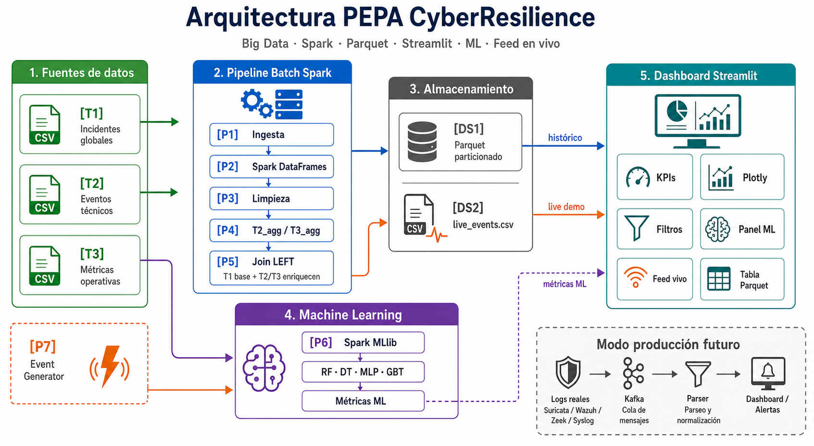

# Pagina 6 - Arquitectura

Esta pagina debe demostrar que PEPA CyberResilience no es solo un dashboard, sino una arquitectura completa de Big Data con tres flujos: batch historico, live/streaming demo y machine learning.

## Que poner en la diapositiva

**Titulo:**

```text
Arquitectura PEPA CyberResilience
```

**Imagen principal:**



**Texto minimo en la diapositiva:**

```text
Batch historico: T1/T2/T3 -> Spark -> Parquet -> Dashboard
Live demo: Event Generator -> live_events.csv -> Dashboard
ML: T3 -> Spark MLlib -> Metricas -> Dashboard
Produccion futuro: Logs reales -> Kafka -> Parser -> Alertas
```

## Idea central que deben transmitir

> La arquitectura tiene tres flujos. El flujo batch procesa datos historicos con Spark y los guarda en Parquet. El flujo live simula eventos en vivo con `event_generator.py` y alimenta el dashboard mediante `live_events.csv`. El flujo ML usa T3 para entrenar modelos de clasificacion y mostrar metricas en el dashboard.

Esta frase es importante porque separa correctamente lo que ya esta implementado:

```text
Implementado:
Spark batch + Parquet + Dashboard + ML + feed live demo
```

De lo que queda como evolucion futura:

```text
Futuro:
Kafka + logs reales + parser + alertas tipo SIEM
```

---

# Como explicar la imagen paso a paso

## 1. Fuentes de datos

En la izquierda de la imagen aparecen las fuentes:

```text
[T1] Incidentes globales
[T2] Eventos tecnicos
[T3] Metricas operativas
[P7] Event Generator
```

T1, T2 y T3 son fuentes historicas en CSV. Estas fuentes entran al flujo batch.

El `Event Generator` es diferente. No entra al pipeline batch; alimenta el flujo live.

### Que explicar oralmente

> Primero tenemos tres datasets historicos. T1 contiene los incidentes principales, T2 agrega informacion tecnica como severidad e IPs, y T3 aporta metricas operativas como duracion, datos comprometidos y tiempo de respuesta. Aparte tenemos un generador de eventos en vivo para simular streaming en modo demo.

### Relacion con visualizacion

- T1 alimenta KPIs de incidentes, paises, perdidas y usuarios afectados.
- T2 alimenta graficos de severidad y eventos tecnicos.
- T3 alimenta datos comprometidos, duracion, ML y metricas operativas.
- `event_generator.py` alimenta el feed en vivo.

---

## 2. Flujo batch historico

El flujo batch es el camino principal del Objetivo 1.

```text
T1/T2/T3 -> pipeline_linux.py -> Spark -> limpieza -> agregacion -> join -> Parquet
```

### Scripts usados

```text
pipeline_linux.py
```

### Fases implementadas

| Fase | Que hace | Resultado |
| --- | --- | --- |
| P1 Ingesta | Lee T1, T2 y T3 con Pandas | DataFrames iniciales |
| P2 Spark DataFrames | Convierte Pandas a Spark | `t1_raw`, `t2_raw`, `t3_raw` |
| P3 Limpieza | Renombra columnas, extrae anio y filtra ataques validos | `t1`, `t2_sampled`, `t3_sampled` |
| P4 Agregacion | Agrupa T2 y T3 para evitar duplicados | `t2_agg`, `t3_agg` |
| P5 Join LEFT | Une T1 con T2_agg y T3_agg | `resultado` consolidado |
| DS1 Parquet | Guarda el resultado particionado | `cybersecurity_joined` |

### Que explicar oralmente

> Este es el procesamiento batch. Se ejecuta para preparar la base historica. Primero cargamos los CSV, luego Spark limpia y transforma los datos. Antes del join agregamos T2 y T3, porque tienen mas granularidad que T1. Finalmente hacemos un LEFT JOIN usando T1 como tabla maestra y guardamos el resultado en Parquet.

### Por que esto es batch

Es batch porque trabaja con datos historicos ya disponibles:

```text
CSV historicos -> procesamiento completo -> salida Parquet
```

No se procesa evento por evento en tiempo real. Se procesa el conjunto completo de datos.

### Relacion con visualizacion

El dashboard no lee T1, T2 y T3 directamente. Lee el resultado ya procesado:

```text
DS1 Parquet -> dashboard.py -> KPIs / graficos / tabla
```

Esto permite que la visualizacion sea mas rapida y ordenada.

---

## 3. Agregacion antes del join

Esta parte puede generar preguntas del profesor, asi que conviene explicarla bien.

El pipeline no hace esto:

```text
T1 JOIN T2 JOIN T3 directo
```

Hace esto:

```text
T2 -> T2_agg por Attack_Type + Year
T3 -> T3_agg por Attack_Type
T1 LEFT JOIN T2_agg
Resultado LEFT JOIN T3_agg
```

### Por que se hizo asi

Porque T2 y T3 tienen mas registros y mayor granularidad. Si se unen directo con T1, los incidentes se pueden duplicar y los KPIs quedan inflados.

### Que explicar oralmente

> La agregacion pre-join es una decision de calidad de datos. No queriamos que el join multiplicara registros. Por eso T1 se mantiene como tabla maestra y T2/T3 solo enriquecen con metricas agregadas.

### Relacion con visualizacion

Gracias a esta decision, los KPIs del dashboard representan incidentes consolidados y no filas duplicadas.

---

## 4. Almacenamiento Parquet

Despues del join, el resultado se guarda como Parquet:

```text
DS1 = cybersecurity_joined
partitionBy(Attack_Type, Year)
```

### Script usado

```text
pipeline_linux.py
```

### Que explicar oralmente

> Parquet es el almacenamiento analitico del proyecto. Lo usamos porque es columnar, comprimido y eficiente para consultas. El dashboard consulta este Parquet, no los CSV brutos.

### Relacion con visualizacion

El dashboard usa:

```text
pd.read_parquet(PARQUET)
```

Y muestra:

- KPIs generales.
- Perdidas financieras.
- Incidentes por tipo de ataque.
- Paises afectados.
- Industrias.
- Severidad T2.
- Datos comprometidos T3.
- Tabla filtrada del Parquet.

---

## 5. Flujo live / streaming demo

Este es el segundo camino de la arquitectura.

```text
event_generator.py -> live_events.csv -> dashboard.py
```

### Script usado

```text
event_generator.py
```

### Que genera

Cada cierto tiempo genera una fila con:

```text
timestamp
attack_type
severity
country
industry
data_GB
outcome
duration_min
```

### Salida

```text
DS2 = live_events.csv
```

### Que explicar oralmente

> Esta es la parte live del proyecto. En esta version no usamos Kafka todavia; usamos un generador de eventos que escribe en `live_events.csv`. El dashboard lee ese archivo cada pocos segundos y muestra el feed en vivo.

### Por que se puede llamar live o streaming demo

Porque no es un batch historico. Los eventos se agregan continuamente mientras el generador esta activo:

```text
nuevo evento -> append CSV -> dashboard refresca -> feed visible
```

Pero debe aclararse:

```text
Es live demo, no streaming productivo con Kafka.
```

### Relacion con visualizacion

El dashboard lee el CSV vivo con cache corto:

```text
load_live() -> ttl 2 segundos
st_autorefresh -> cada 3 segundos
```

Y muestra:

- Ultimos eventos.
- Total acumulado.
- Ataque mas frecuente.
- Severidad promedio.
- Success rate.

---

## 6. Flujo Machine Learning

El tercer camino es ML.

```text
T3 -> pipeline_linux.py / ml_v2.py -> metricas ML -> dashboard.py
```

### Scripts usados

```text
pipeline_linux.py
ml_v2.py
```

### Objetivo ML

El Objetivo 2 usa T3 porque contiene variables tecnicas.

Variables base:

```text
data_compromised_GB
attack_duration_min
attack_severity
response_time_min
```

Modelos:

```text
RandomForest
DecisionTree
MLP
GBT
```

### Que explicar oralmente

> La parte ML no usa directamente el join completo. Para el Objetivo 2 usamos T3 porque contiene variables tecnicas mas adecuadas para clasificar ataques. El modelo principal es RandomForest con Spark MLlib, y en la version mejorada comparamos otros modelos.

### Relacion con visualizacion

El dashboard muestra el panel ML con:

- Metricas F1 / Accuracy.
- Comparacion entre modelos.
- Importancia de variables.

Aclaracion importante:

> El dashboard muestra resultados ML; no entrena modelos en vivo durante la visualizacion.

---

## 7. Dashboard Streamlit

El dashboard es la capa de visualizacion.

### Script usado

```text
dashboard.py
```

### Entradas reales

```text
DS1 Parquet: ~/bigdata/output/cybersecurity_joined
DS2 Live CSV: ~/bigdata/output/live_events.csv
Metricas ML: resultados de ejecucion del pipeline ML
```

### Que muestra

| Modulo visual | Fuente principal | Explicacion |
| --- | --- | --- |
| KPIs | Parquet + live CSV | Incidentes, perdida, usuarios, paises y eventos vivos |
| Graficas Plotly | Parquet | Tendencias, distribucion, paises, industrias |
| Filtros | Parquet | Anio, tipo de ataque e industria |
| Panel ML | Resultados ML | Comparacion de modelos y metricas |
| Feed vivo | `live_events.csv` | Eventos generados en modo demo |
| Tabla datos | Parquet filtrado | Muestra registros consolidados |

### Que explicar oralmente

> El dashboard no reemplaza al pipeline. Es la capa de consumo. Lee el Parquet para la parte historica y lee `live_events.csv` para la parte live. Por eso se ve tanto analisis historico como monitoreo simulado en vivo.

---

## 8. Modo produccion futuro

En la imagen aparece como futuro:

```text
Logs reales -> Kafka -> Parser -> Dashboard / Alertas
```

### Que significa

La version actual usa `event_generator.py`. En produccion se reemplazaria por herramientas reales:

```text
Suricata
Wazuh
Zeek
Syslog
Firewall logs
```

Y una cola de eventos:

```text
Kafka
```

### Que explicar oralmente

> Kafka no esta implementado en esta version. Lo mostramos como evolucion natural para produccion. Hoy el feed se simula con CSV; manana ese CSV puede reemplazarse por Kafka y logs reales parseados.

---

# Guion oral recomendado para la pagina 6

Usar este texto cuando muestren la imagen:

> Esta es la arquitectura completa de PEPA CyberResilience. A la izquierda tenemos las fuentes de datos: T1, T2 y T3. Esas tres fuentes entran al flujo batch, donde `pipeline_linux.py` usa Pandas y Spark para leer, limpiar, agregar y unir los datos. La agregacion antes del join es importante porque evita duplicados: T1 queda como tabla maestra y T2/T3 enriquecen los incidentes.
>
> El resultado del batch se guarda en Parquet particionado por tipo de ataque y anio. Ese Parquet alimenta el dashboard Streamlit para mostrar KPIs, graficos, filtros y tabla de datos.
>
> En paralelo tenemos el flujo live demo. `event_generator.py` genera eventos simulados y los escribe en `live_events.csv`. El dashboard lee ese archivo cada pocos segundos, por eso podemos mostrar un feed en vivo.
>
> Tambien tenemos el flujo ML. Para el Objetivo 2 usamos T3, porque contiene variables tecnicas para clasificacion. Con Spark MLlib entrenamos modelos como RandomForest, DecisionTree, MLP y GBT, y sus metricas se muestran en el panel ML.
>
> Finalmente, la parte gris de la imagen representa el modo produccion futuro: reemplazar el generador por logs reales, Kafka, parser y alertas. Por eso la solucion ya tiene una ruta hacia monitoreo tipo SIEM.

---

# Preguntas probables sobre esta pagina

## 1. Donde esta aplicado batch?

Respuesta:

> Batch esta aplicado en el procesamiento historico de T1, T2 y T3. Se ejecuta con `pipeline_linux.py`, procesa los CSV completos con Spark y genera el Parquet consolidado.

Sustento:

```text
T1/T2/T3 -> Spark -> Join -> Parquet
```

## 2. Donde esta aplicado streaming o live?

Respuesta:

> Esta aplicado en el feed en vivo. En modo demo, `event_generator.py` escribe eventos continuamente en `live_events.csv` y el dashboard los refresca cada pocos segundos.

Sustento:

```text
event_generator.py -> live_events.csv -> dashboard.py
```

## 3. Eso es streaming real?

Respuesta:

> Es live demo o streaming simulado. No es Kafka real todavia. Sirve para demostrar la visualizacion en vivo y deja preparada la evolucion a produccion.

## 4. Por que no usaron Kafka directamente?

Respuesta:

> Porque el alcance actual es academico y demostrativo. Kafka tiene mas sentido cuando ya hay logs reales continuos. En nuestra arquitectura Kafka queda como modo produccion futuro.

## 5. Como se relaciona la arquitectura con la visualizacion?

Respuesta:

> El dashboard consume dos salidas de la arquitectura: el Parquet consolidado para analisis historico y `live_events.csv` para eventos en vivo. Por eso la visualizacion muestra tanto KPIs historicos como feed live.

## 6. El dashboard procesa los datos brutos?

Respuesta:

> No. El procesamiento pesado lo hace Spark en `pipeline_linux.py`. El dashboard solo consume datos ya preparados: Parquet y CSV live.

## 7. Por que T1 es la tabla base?

Respuesta:

> Porque T1 contiene los incidentes principales con pais, anio, industria, perdida financiera y usuarios afectados. T2 y T3 enriquecen esos incidentes con informacion tecnica.

## 8. Por que agregaron T2 y T3 antes del join?

Respuesta:

> Para evitar duplicados. T2 y T3 tienen mayor granularidad; si se unen directo, pueden multiplicar los incidentes de T1 y alterar los KPIs.

## 9. Por que usan Parquet?

Respuesta:

> Porque Parquet es columnar, comprimido y eficiente para analitica. Ademas permite particionar por `Attack_Type` y `Year`, lo que facilita consultas y filtros.

## 10. Que parte puede ser cuello de botella?

Respuesta:

> Puede estar en el join si no se agregan T2/T3, en Spark local por RAM/CPU, en el dashboard si lee demasiados datos, y en `live_events.csv` si crece mucho. Por eso proponemos Kafka y almacenamiento historico en produccion.

## 11. El modelo ML se entrena desde el dashboard?

Respuesta:

> No. El entrenamiento se realiza en `pipeline_linux.py` y `ml_v2.py`. El dashboard muestra las metricas resultantes.

## 12. El Objetivo 2 usa el dataset consolidado completo?

Respuesta:

> No exactamente. El Objetivo 2 usa principalmente T3 porque contiene variables tecnicas para clasificacion. El dataset consolidado se usa para analisis y visualizaciones del Objetivo 1.

## 13. Esto ya es un SIEM?

Respuesta:

> No es un SIEM completo. Es una base de ciberresiliencia con pipeline, dashboard, ML y feed live demo. Puede evolucionar a mini-SIEM agregando logs reales, Kafka, parser, correlacion y alertas.

---

# Frase final para cerrar la arquitectura

> Esta arquitectura demuestra el ciclo completo de datos: ingesta, procesamiento, almacenamiento, visualizacion, machine learning y monitoreo live. La version actual funciona como demo/laboratorio, y la misma estructura puede evolucionar a produccion con Kafka y logs reales.
